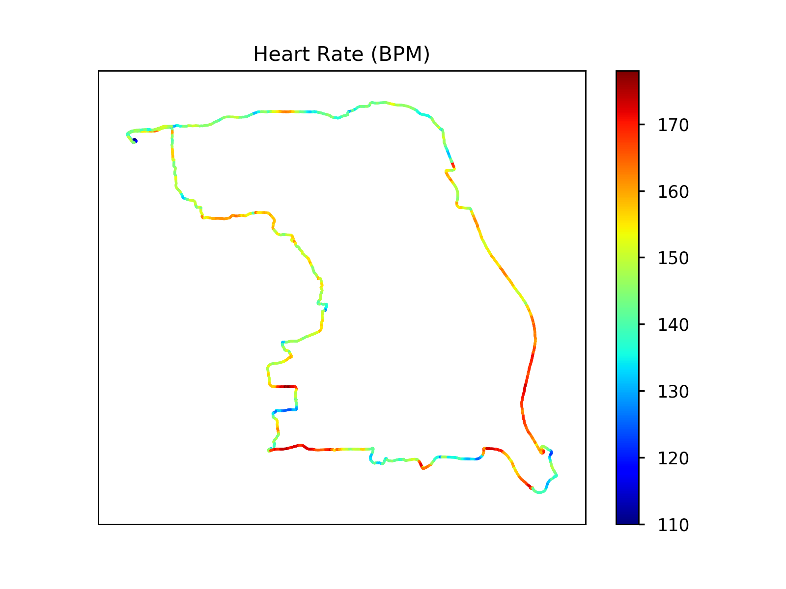
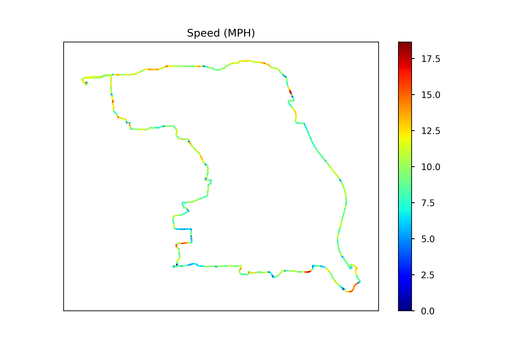
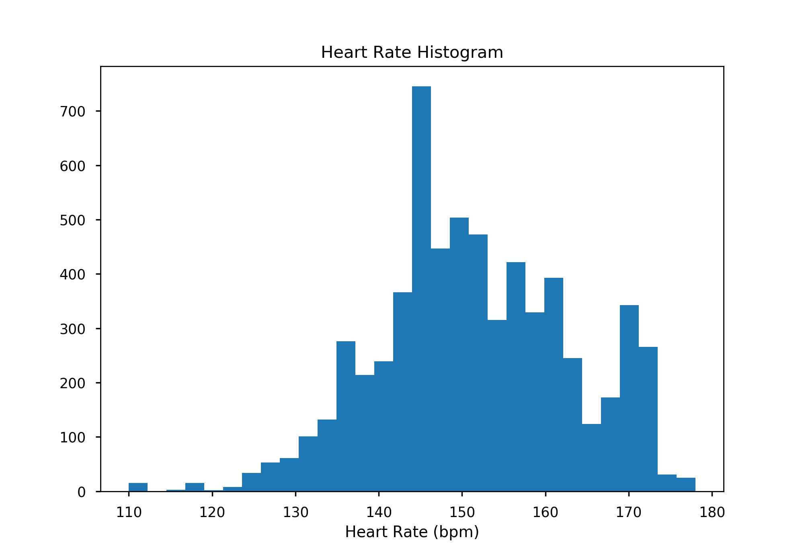
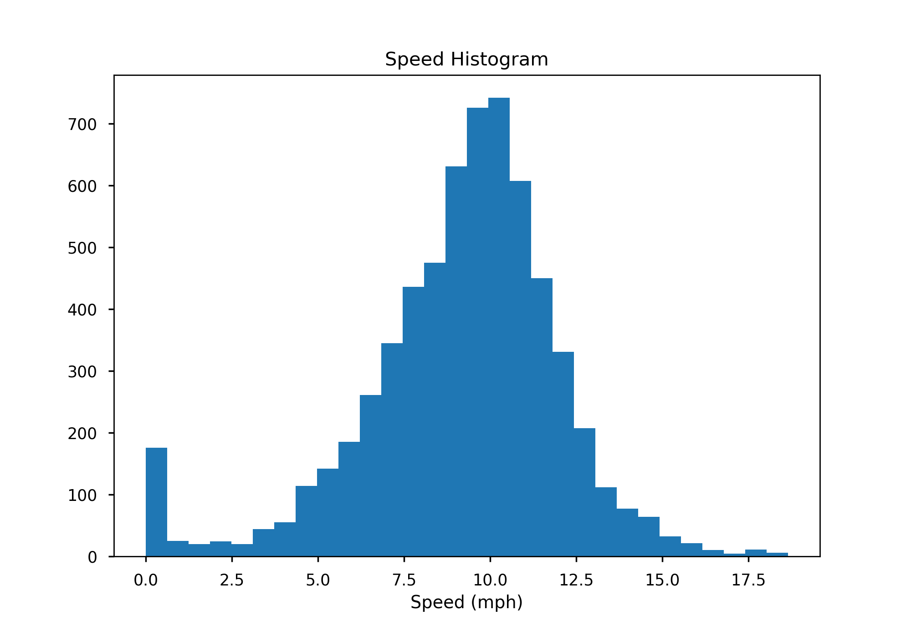
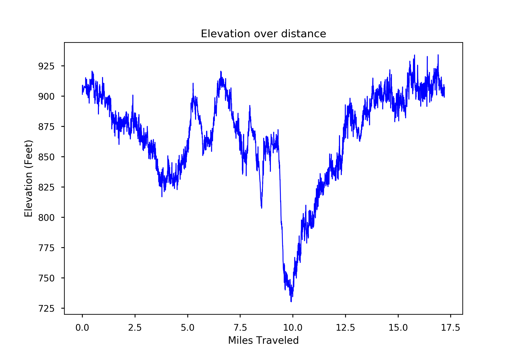

# Apple-Watch-Strava-Parse-Viz
This jupyter notebook script uses matplotlib to generate interesting visualizations of a Bike/Run/Whatever recorded by the Strava Apple Watch App

# Graphics generated

  
  

  
  

  

# Packages used

- [Matplotlib](https://matplotlib.org/)

- [Json5](https://json5.org/)

# Compatible Files

Json Files generated by the Apple Watch Strava App. Can be found by going to your own Strava activity and clicking [Export Original](images/howto.png)

# How to Run

<b> Easiest method </b>

1. Install [Anaconda Navigator](https://docs.anaconda.com/anaconda/navigator/install/)
2. Open stravaparse.ipynb with jupyter notebook
3. Drop ride file into the same folder as stravaparse.ipynb
4. Rename ride file to ride.json
5. Run cell by cell using Shift + Enter
Note: Images of each graph will be saved as png's
