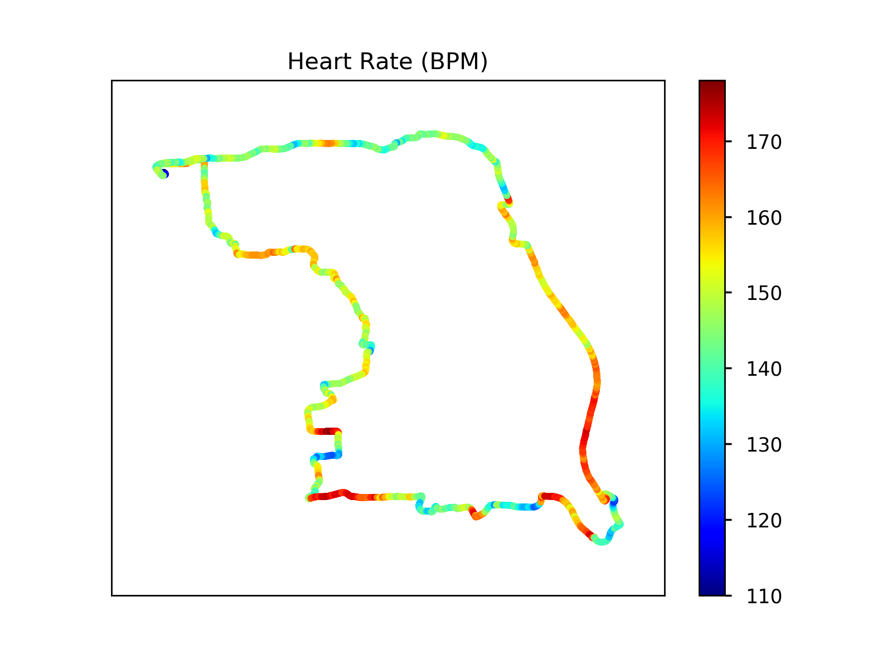
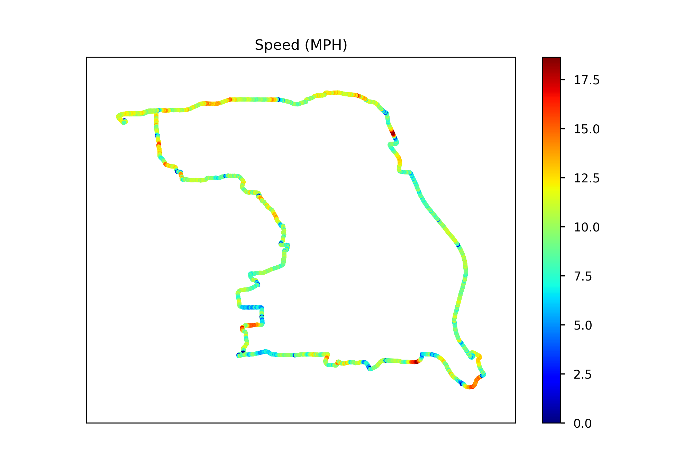

# Apple-Watch-Strava-Parse-Viz
This jupyter notebook script uses matplotlib to generate interesting visualizations of a Bike/Run/Whatever recorded by the Strava Apple Watch App

# Graphics generated

  
  

  
  

  

